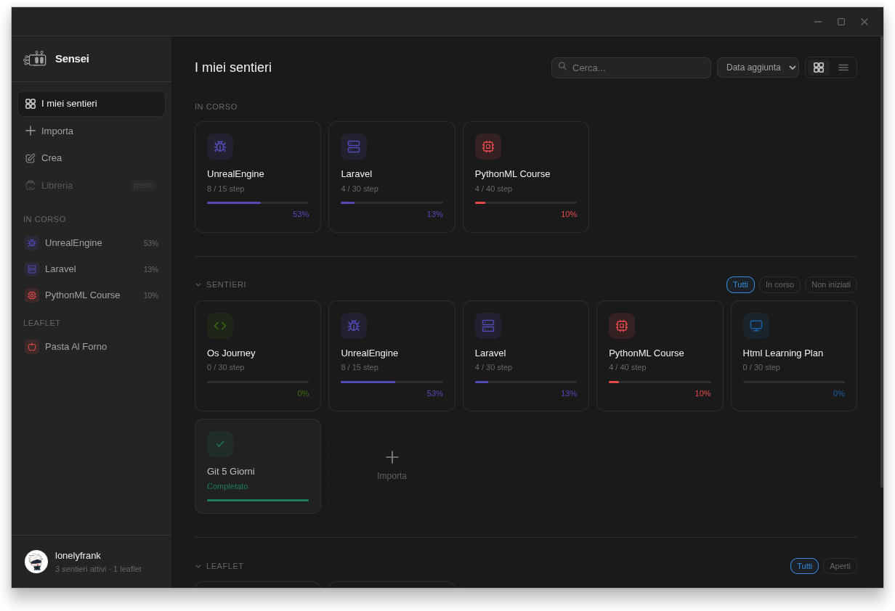
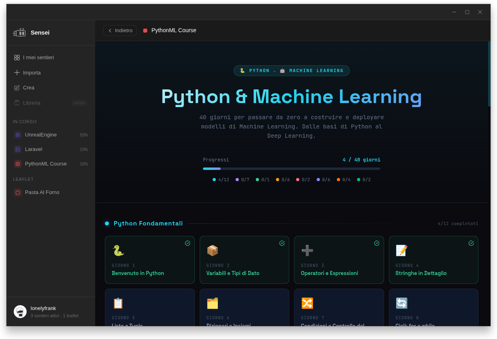
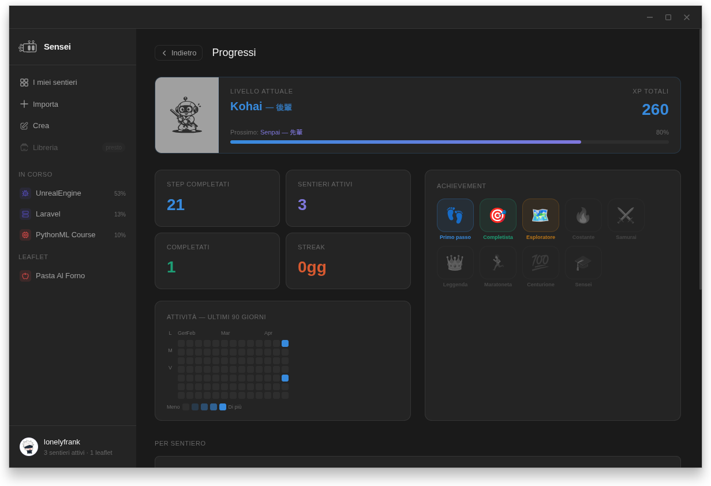
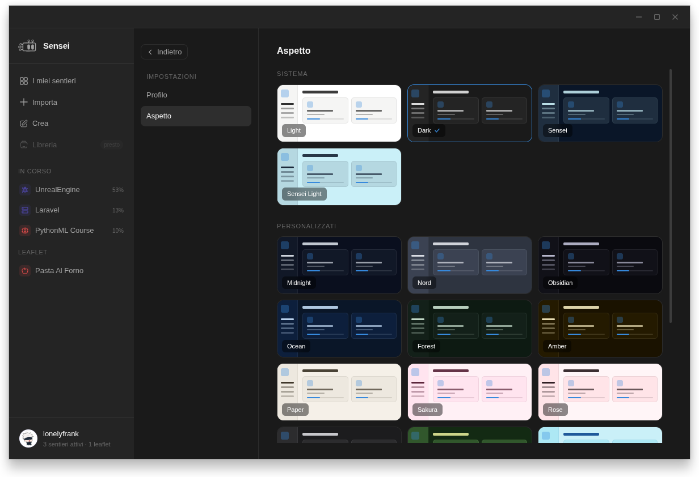

# Sensei 先生

> **⚠️ Work in Progress** — Sensei è in sviluppo attivo. Le feature principali sono funzionanti ma l'app non è ancora in versione stabile.

---

**🇮🇹 Un runner desktop per artifact interattivi generati dall'AI.**
**🇬🇧 A desktop runner for interactive AI-generated artifacts.**

---

## 📸 Screenshot

<p align="center">
  
</p>

<p align="center">
  
</p>

<p align="center">
  
</p>

<p align="center">
  
</p>

---

## 🇮🇹 Cos'è Sensei

Sensei è un'applicazione desktop costruita con Electron e React che permette di caricare, eseguire e tracciare **artifact interattivi in formato JSX** generati da assistenti AI come Claude.

L'idea nasce da una domanda semplice: e se potessimo dare all'AI il compito di costruire non solo risposte, ma **esperienze interattive complete** — corsi, guide, percorsi di apprendimento, ricette, schede tecniche — e avere un posto dove eseguirle, seguirle e misurare i progressi?

Sensei è quel posto.

### Sentieri e Leaflet

Sensei distingue due tipi di artifact:

- **Sentieri** — percorsi strutturati che si protraggono nel tempo. Un corso di programmazione, un programma di allenamento, un piano di formazione aziendale, un percorso benessere. Ogni sentiero ha step progressivi, tracciamento dei progressi, XP e livelli.

- **Leaflet** — documenti consultabili in singola sessione. Una ricetta, una guida di configurazione, una scheda tecnica, un minicorso su un singolo concetto. Pensati per essere aperti, seguiti e tenuti come riferimento.

### Compatibilità con l'AI

Sensei è progettato per leggere e eseguire artifact generati da qualsiasi assistente AI, con una compatibilità che cresce progressivamente. Include un sistema di rilevamento automatico del tipo di artifact (sentiero o leaflet), del numero di step e della struttura del contenuto — anche per artifact non generati con il prompt nativo di Sensei.

L'obiettivo a lungo termine è rendere Sensei capace di interpretare e ospitare qualsiasi forma di artifact interattivo generato dall'AI, adattandosi alle tecniche e alle tecnologie in continua evoluzione.

---

## 🇬🇧 What is Sensei

Sensei is a desktop application built with Electron and React that allows you to load, run, and track **interactive JSX artifacts** generated by AI assistants like Claude.

The idea comes from a simple question: what if we could ask AI to build not just answers, but **complete interactive experiences** — courses, guides, learning paths, recipes, technical sheets — and have a place to run them, follow them, and measure progress?

Sensei is that place.

### Sentieri and Leaflet

Sensei distinguishes two types of artifacts:

- **Sentieri** (paths) — structured journeys that extend over time. A programming course, a training program, a corporate onboarding plan, a wellness journey. Each sentiero has progressive steps, progress tracking, XP and levels.

- **Leaflet** — single-session consultable documents. A recipe, a configuration guide, a technical reference sheet, a mini-course on a single concept. Designed to be opened, followed, and kept as reference.

### AI Compatibility

Sensei is designed to read and run artifacts generated by any AI assistant, with progressively growing compatibility. It includes an automatic detection system for artifact type (sentiero or leaflet), step count, and content structure — even for artifacts not generated with Sensei's native prompt.

The long-term goal is to make Sensei capable of interpreting and hosting any form of interactive AI-generated artifact, adapting to continuously evolving techniques and technologies.

---

## ✨ Feature

- 🗂️ **Dashboard** — griglia e lista di sentieri e leaflet, sezioni collassabili, ricerca, filtri e ordinamento
- 📄 **Visualizzatore artifact** — iframe sandboxed con React 18, Lucide React, Tailwind CSS
- 💾 **Persistenza progressi** — storage SQLite locale, sincronizzazione automatica degli step completati
- 🎮 **Gamification** — sistema XP, 5 livelli (Mugei → Sensei), achievement badge con kanji
- 🎉 **Feedback completamento** — toast animato e flash sulla card al completamento di un sentiero
- 🎨 **12 temi** — Light, Dark, Sensei, Sensei Light, Midnight, Nord, Obsidian, Ocean, Forest, Amber, Paper, Sakura, Rose, Graphite
- ✦ **Crea con AI** — generatore di prompt ottimizzati per Claude, separato per Sentieri e Leaflet
- 🔍 **Rilevamento automatico** — tipo artifact, numero di step, struttura del contenuto
- 🖥️ **UI nativa** — titlebar custom, sidebar con effetto bulge lerp, modalità collapsed icon-only

---

## 🛠️ Tech Stack

| Layer | Tecnologia |
|---|---|
| Desktop | Electron |
| UI | React 18 + Vite |
| Database | better-sqlite3 (SQLite locale) |
| Icone | lucide-react |
| SVG | vite-plugin-svgr |
| Artifact runtime | Babel standalone + Tailwind CDN (in iframe) |

---

## 🚀 Installazione / Installation

```bash
# Clona il repository
git clone https://github.com/lonelyfrank/sensei-learning.git
cd sensei-learning

# Installa le dipendenze
npm install

# Avvia in modalità sviluppo
NODE_ENV=development npm run dev
```

> Richiede Node.js 18+ e npm 9+

---

## 🗺️ Roadmap

- [ ] Build/installer cross-platform (Windows, macOS, Linux) con electron-builder
- [ ] Test cross-platform v1.0
- [ ] Libreria pubblica di sentieri e leaflet
- [ ] Compatibilità progressiva con artifact non nativi
- [ ] Editor visuale artifact
- [ ] Template predefiniti

---

## 👤 Crediti / Credits

**Autore / Author** — [lonelyfrank](https://github.com/lonelyfrank)

**Assistente allo sviluppo / Development assistant** — [Claude](https://claude.ai) by Anthropic

Sensei è nato da una collaborazione umano-AI: la visione, le decisioni di prodotto e il design sono di Frank; l'implementazione è stata realizzata in coppia con Claude.

*Sensei was born from a human-AI collaboration: the vision, product decisions, and design belong to Frank; the implementation was built in pair with Claude.*

---

<p align="center">
  <sub>先生 — Il maestro non smette mai di imparare / The master never stops learning</sub>
</p>
